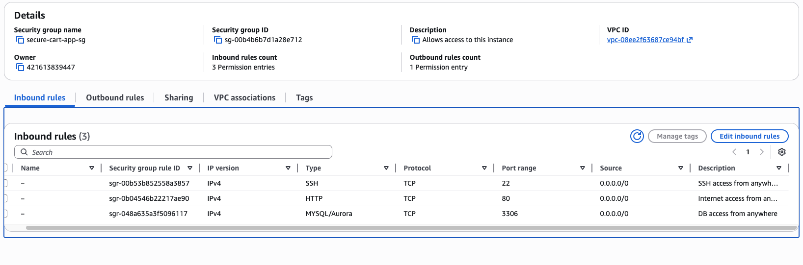
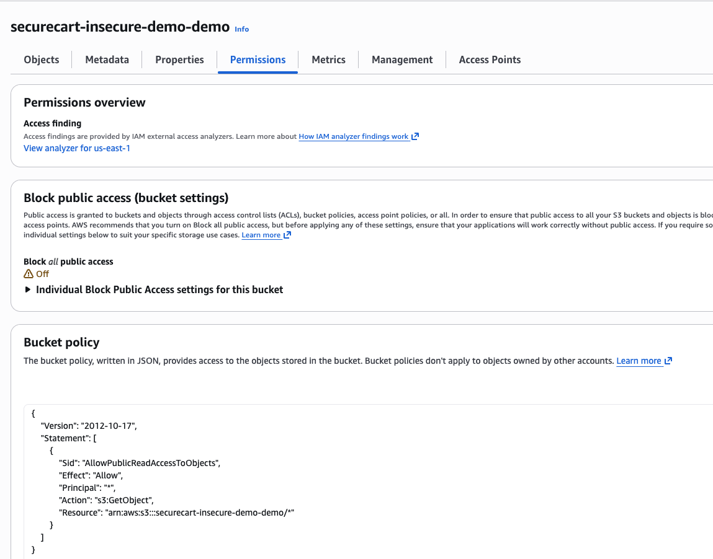
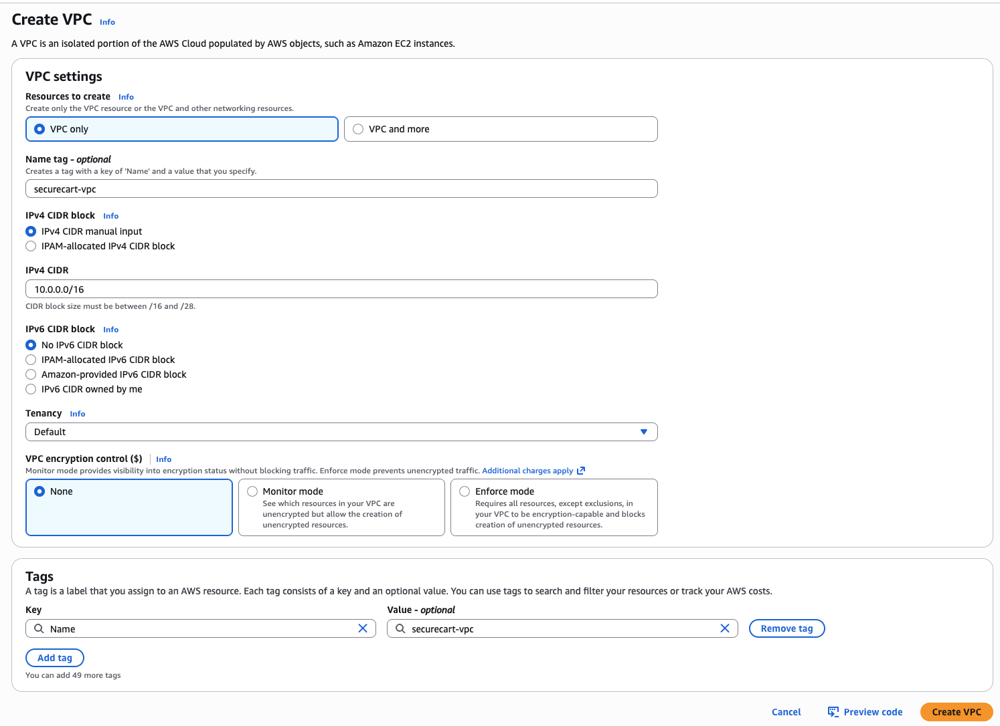

# Secure App Deployment

## 🌟 Overview
**Scenario** 
SecureCart is a fast-growing e-commerce platform that initially launched with a focus on speed rather than security. As a result, its infrastructure left key resources - EC2, S3, and RDS, exposed directly to the public internet. With over 10,000 customers, SecureCart now faces significant risks including unauthorized access, data breaches, and compliance issues. A secure cloud redesign is urgently needed.

**Your Role**
In this project, you’ll act as a cloud security-focused Solutions Architect. Your mission is to take a vulnerable cloud environment and transform it into a secure, production-ready architecture using AWS-native tools and best practices.

We’ll begin by deploying the **insecure baseline**, exposing common mistakes. Then, you’ll rebuild the entire setup step by step, following security-first design principles aligned with the **AWS Well-Architected Framework**.

#### What I Learned
* Designing secure network architectures using VPC
* Isolating services with private/public subnets
* Locking down access with security groups and IAM
* Securing data using encryption at rest and in transit
* Safely exposing apps using ALB and WAF

## 🛠️ Services used
* **Amazon VPC**: Isolate application layers and control traffic using private/public subnets
* **Amazon EC2**: Host the application backend, migrated to private subnets
* **Amazon RDS**: Secure relational database with encryption and private access
* **Amazon S3**: Object storage configured with private access only
* **AWS CloudFront**: Secure content delivery with HTTPS enforcement
* **AWS IAM**: Role-based access control with least-privilege enforcement
* **Application Load Balancer (ALB)**: Public endpoint forwarding to private app
* **AWS WAF**: Adds basic protection against common Layer 7 threats

## Vulnerabilities Demonstrated
* The security group below is used for the ec2 instance and RDS MySQL DB.
    * Critical Vulnerability: SSH/RDS MySQL DB access from 0.0.0.0/0 allows anyone on the internet to attempt login to your server. 

* The S3 bucket policy below is used for the bucket below.
    * This allows all users (even unauthenticated) to read any object in this bucket.

**Network Security Issues**

* No network segmentation between tiers
* All resources in public subnets
* Overly permissive security groups

**Data Protection Failures**
* Database exposed to public internet
* No encryption for data at rest or in transit
* Publicly accessible file storage

**Access Control Problems**
* SSH access from anywhere
* Database accessible globally
* No IAM role-based access controls

**Monitoring and Compliance Gaps**
* No logging or monitoring configured
* No threat detection enabled
* No compliance tracking

## ☁️ AWS Architecture

## &rarr; Final Result

In this project, I transformed SecureCart from a vulnerable, internet-exposed app into a **production-grade, secure cloud environment**.

I didn’t just patch security issues, I designed a secure foundation from the ground up.

#### Here’s what yoIu achieved:bastion-sg

* **Isolated backend resources** (EC2 and RDS) in private subnets with no direct internet access
* **Exposed only the ALB to the public**, minimizing attack surface while maintaining app availability
* **Restricted access with Security Groups and IAM**, enforcing the principle of least privilege
* **Enabled encryption** for data at rest (RDS, S3) and in transit (via HTTPS)
* **Added AWS WAF** to filter out common web exploits like SQL injection and admin page exposure

<!--  -->
Add these five projects to the features projects:
Build a CI/CD Pipeline for the 2048 Game using AWS CodePipeline, ECS, and ECR
Stock Market Real-Time Data Analytics Pipeline on AWS
Building & Deploying a Cybersecurity Threat Detection System using Amazon SageMaker
Multi-Cloud Weather Tracker website with Disaster Recovery using Terraform
Traditional 3-Tier WordPress website Deployment on AWS

Update the description for the project with title "Traditional 3-Tier WordPress Deployment on AWS" in the feature project with "This project involves deploying a WordPress website using a 3-Tier Traditional Architecture on AWS. The architecture ensures scalability, reliability, and security for hosting the website. Key components include:

Network Setup: Configuring a VPC with 2 public subnets and 4 private subnets. An Internet Gateway (IGW) is used for external connectivity, while 2 NAT Gateways in public subnets provide internet access for resources in private subnets.
Load Balancing: An Application Load Balancer (ALB) distributes incoming traffic to the instances.
Compute Layer: Two EC2 instances are deployed in private subnets for hosting the WordPress application.
Database Layer: An Amazon RDS instance is configured in the private subnets.
Routing and Security: Route tables and security groups are set up for controlling traffic flow and ensuring resource protection." make it short and concise